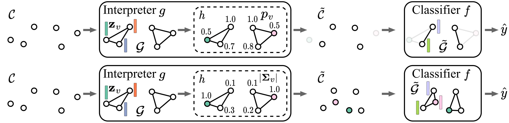
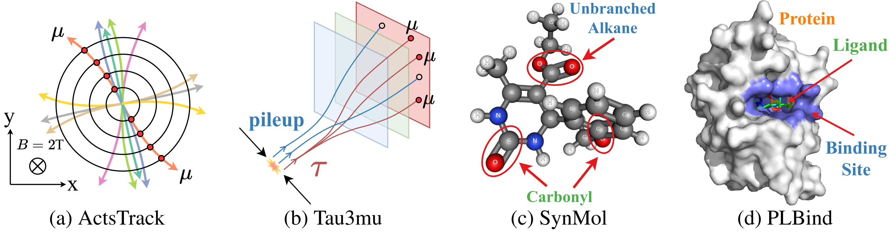

<h1 align="center">Learnable Randomness Injection (LRI)</h1>
<p align="center">
    <a href="https://arxiv.org/abs/2210.16966"></a>
    <a href="https://github.com/Graph-COM/LRI"></a>
    <a href="https://openreview.net/forum?id=6u7mf9s2A9">  </a>
    <!-- <a href="https://github.com/Graph-COM/GSAT/blob/main/LICENSE">  </a>
    <a href="https://icml.cc/virtual/2022/spotlight/17430"> </a>
    <a href="https://icml.cc/media/icml-2022/Slides/17430.pdf"> </a>
    <a href="https://icml.cc/media/PosterPDFs/ICML%202022/a8acc28734d4fe90ea24353d901ae678.png"> </a> -->
</p>


This repository contains the official implementation of LRI as described in the paper: [Interpretable Geometric Deep Learning via Learnable Randomness Injection](https://arxiv.org/abs/2210.16966) by Siqi Miao, Yunan Luo, Mia Liu, and Pan Li.

## News
- Jan. 21, 2023: This paper is accepted to [ICLR 2023](https://openreview.net/forum?id=6u7mf9s2A9)!
- Oct. 20, 2022: This paper will show up at NeurIPS 2022 [AI for Science](https://ai4sciencecommunity.github.io/neurips22.html) Workshop!

## Introduction
This work systematically studies interpretable Geometric Deep Learning (GDL) models by proposing a framework **Learnable Randomness Injection (LRI)** and **four datasets with ground-truth interpretation labels** from real-world scientific applications in Particle Physics and Biochemistry.

We study the interpretability in GDL from the perspectives of **existence importance** and **location importance** of points, and instantiated LRI with LRI-Bernoulli and LRI-Gaussian to test the two types of importance, respectively. Fig. 1 shows the architectures of LRI.

The intuition is that if the **existence** of some points is important, then imposing large Bernoulli randomness on their existence will greatly affect the prediction loss; while if the **geometric locations** of some points are important, imposing large Gaussian randomness on their coordinates should also affect the prediction loss significantly. Therefore, to achieve great prediction accuracy, LRI will denoise those important points, and thus the learned randomness level measures the importance of the points.


<p align="center"></p>
<p align="center"><em>Figure 1.</em> The architectures of LRI-Bernoulli (top) and LRI-Gaussian (bottom). </p>


## Datasets
All our datasets can be downloaded and processed automatically by running the scripts in `./src/datasets`. By default, the code will ask if the raw files and/or the processed files should be downloaded. For example, to download and process the `SynMol` dataset, simply run:
```
cd ./src/datasets
python synmol.py
```

All datasets are also available to download from Zenodo manually: https://doi.org/10.5281/zenodo.7265547. Fig. 2 provides the illustrations of the four datasets, and Tab. 1 shows the statistics of them. We will update the description of each dataset with more details in `README.md` soon.

<p align="center"></p>
<p align="center"><em>Figure 2.</em> Illustrations of the four scientific datasets in this work to study interpretable GDL models. </p>


| Dataset | # Classes | # Dim. of $\mathbf{X}$, $\mathbf{r}$ | # Samples | Avg. # Points/Sample | Avg. # Important Points/Sample |  Class Ratio |  Split Ratio |
| :---      |     :---:      | :---: |  :---: | :---: | :---: | :---: | :---: |
| ActsTrack | 2 | 0, 3  | 3241   | 109.1 |  22.8 |  39/61  |  70/15/15 |
| Tau3Mu    | 2 | 1, 2  | 129687 | 16.9  | 5.5   |  24/76  |  70/15/15 |
| SynMol    | 2 | 1, 3  | 8663   | 21.9  |  6.6  |  18/82  |  78/11/11 |
| PLBind    | 2 | 3, 3  | 10891  | 339.8 | 132.2 |  29/71  |  92/6/2   |
<p align="center"><em>Table 1.</em> Statistics of the four datasets. $\mathbf{X}$ denotes point features, and $\mathbf{r}$ denotes geometric coordinates. </p>


## Installation
We have tested our code on `Python 3.9` with `PyTorch 1.12.1`, `PyG 2.0.4` and `CUDA 11.3`. Please follow the following steps to create a virtual environment and install the required packages.

Step 1: Clone the repository
```
git clone https://github.com/Graph-COM/LRI.git
cd LRI
```

Step 2: Create a virtual environment
```
conda create --name lri python=3.9 -y
conda activate lri
```

Step 3: Install dependencies
```
conda install -y pytorch==1.12.1 torchvision cudatoolkit=11.3 -c pytorch
pip install torch-scatter==2.0.9 torch-sparse==0.6.14 torch-cluster==1.6.0 torch-geometric==2.0.4 -f https://data.pyg.org/whl/torch-1.12.0+cu113.html
pip install -r requirements.txt
```

<!-- ## Running Examples
TODO -->

## Reproducing Results
Use the following command to train a model:

```
cd ./src
python trainer.py --backbone [backbone_model] --dataset [dataset_name], --method [method_name]
```
`backbone_model` can be chosen from `dgcnn`, `pointtrans` and `egnn`.

`dataset_name` can be chosen from `actstract_2T`, `tau3mu`, `synmol` and `plbind`, and the dataset specified will be downloaded automatically.

`method_name` can be chosen from `lri_bern`, `lri_gaussian`, `gradcam`, `gradgeo`, `bernmask`, `bernmask_p`, and `pointmask`.

By adding `--cuda [GPU_id]` to the command, the code will run on the specified GPU; by adding `--seed [seed_number]` to the command, the code will run with the specified random seed.

The tuned hyperparameters for all backbone models and interpretation methods can be found in `./src/config`.


## Reference

If you find our paper and repo useful, please cite our paper:
```bibtex
@article{miao2023interpretable,
  title       = {Interpretable Geometric Deep Learning via Learnable Randomness Injection},
  author      = {Miao, Siqi and Luo, Yunan and Liu, Mia and Li, Pan},
  journal     = {International Conference on Learning Representations},
  year        = {2023}
}
```
